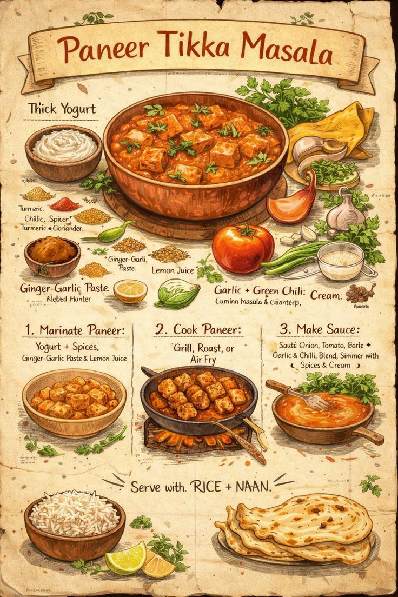

# Recetario Indio Ilustrado

A static site generator for a **28-recipe Indian cookbook** with an 8-week weight-loss meal plan. Produces a single self-contained `index.html` with a vintage aesthetic, AI-generated watercolour images, and infographic-style recipe cards.



---

## Features

- **28 Indian recipes** — breakfasts, lunches, and dinners covering a full 8-week plan
- **Vintage parchment UI** — layered CSS gradients simulate aged paper with coffee-stain rings, edge vignetting, and paper grain
- **Handwritten typography** — Dancing Script (titles) + Kalam (body) served via Google Fonts
- **Infographic recipe cards** — ingredient icons flanking a central hero photo, 4-column step grid with polaroid-style photos
- **AI image pipeline** — Gemini prompt rewriter → ComfyUI (Flux2 or Z-Image backend) → CDN-served `.webp`
- **Watercolour ingredient icons** — per-ingredient illustrations served from a self-hosted CDN
- **Per-step procedure photos** — CDN watercolour vignettes for each cooking step
- **8-week meal plan tab** — rendered from `meal_plan.md` alongside the recipe grid
- **Macro validation** — CLI command to verify P/C/F totals per recipe
- **Standalone output** — `output/index.html` bundles all assets; open with any browser, no server needed

---

## Nutrition at a Glance

| Metric | Value |
|---|---|
| Recipes | 28 |
| Average calories / recipe | ~271 kcal |
| Average protein | 15.6 g |
| Average carbs | 32.6 g |
| Average fat | 7.6 g |

Designed for a **1,200–1,400 kcal/day** target (60 kg → 52 kg, 8 weeks, 157 cm, age 26).

---

## Project Structure

```
Food_Plan/
├── generate.py            # CLI entry point (click)
├── meal_plan.md           # 8-week plan rendered as a second tab
├── requirements.txt
├── data/
│   ├── recipes.yaml           # All 28 recipes (ingredients, steps, macros, images)
│   ├── ingredient_image_map.json  # slug → CDN URL for ingredient icons
│   └── step_image_map.json        # recipe__step → CDN URL for step photos
├── src/
│   ├── models.py          # Recipe, Nutrition, Step dataclasses
│   ├── parser.py          # YAML → Recipe objects
│   ├── generator.py       # Jinja2 renderer → output/index.html
│   ├── macros.py          # Nutrition validation & summary
│   ├── image_gen.py       # ComfyUI workflow (Flux2 / Z-Image)
│   ├── prompt_rewriter.py # Gemini-powered prompt enhancement
│   ├── ingredient_gen.py  # Ingredient icon generation
│   └── step_gen.py        # Per-step image generation
├── templates/
│   ├── index.html.j2      # Main site template
│   └── cards.html.j2      # Standalone printable recipe cards
├── images/                # Local .webp overrides (generated)
├── imag_references/       # Visual inspiration boards
└── output/                # Built artefacts (git-ignored)
```

---

## Quick Start

### Prerequisites

```bash
python3 -m venv .venv && source .venv/bin/activate
pip install -r requirements.txt
```

### Build the site

```bash
python generate.py                    # → output/index.html
python generate.py --output my.html   # custom output path
```

Open `output/index.html` in any browser — no server required.

### CLI commands

| Command | Description |
|---|---|
| `python generate.py` | Build `output/index.html` |
| `python generate.py validate` | Check macro totals for all recipes |
| `python generate.py macros` | Print nutrition summary table |
| `python generate.py plan` | Analyse 8-week meal plan feasibility |
| `python generate.py cards` | Build printable `output/cards.html` |
| `python generate.py regen-images` | Re-run AI image generation pipeline |
| `python generate.py regen-images --id dal_khichdi` | Regenerate one recipe image |

### Image generation (optional)

Requires ComfyUI running locally and a `GOOGLE_API_KEY` for Gemini prompt rewriting:

```bash
# Start ComfyUI first
cd ~/ComfyUI && python main.py --listen 127.0.0.1 --port 8188 --lowvram

# Regenerate all images
python generate.py regen-images --backend flux2

# Force refresh even if .webp already exists
python generate.py regen-images --override --refresh-prompts
```

---

## Recipe Data Format

Recipes live in `data/recipes.yaml`. Each entry:

```yaml
- id: dal_khichdi
  name: Dal Khichdi
  subtitle: Arroz y lenteja reconfortante
  phase: Fase 1
  meal: Almuerzo
  type: Vegetariano
  prep: 10 min
  cook: 25 min
  servings: 1
  nutrition:
    kcal: 310
    protein: 14
    carbs: 52
    fat: 6
  image:
    src: images/placeholder.webp
    css_class: food-warm
  highlight_ingredients:
    - Arroz
    - Dal amarillo
    - Ghee
    - Cúrcuma
    - Comino
  ingredients:
    - ½ taza arroz basmati
    - ½ taza dal amarillo
    - 1 cdta ghee
    - ½ cdta cúrcuma
    - 1 cdta comino
  steps:
    - icon: flame
      action: Hervir
      time: 15 min
      text: Cocinar arroz y dal juntos en olla con cúrcuma y sal.
    - icon: pot
      action: Temperar
      time: 5 min
      text: Freír comino en ghee, verter sobre el khichdi.
  tip: Añadir un chorrito de jugo de limón al servir.
```

---

## Tech Stack

| Layer | Technology |
|---|---|
| Templating | Jinja2 |
| Styling | Vanilla CSS (CSS variables, grid, custom properties) |
| Fonts | Google Fonts — Dancing Script, Kalam, Playfair Display, Cinzel Decorative |
| CLI | Click + Rich |
| Data | YAML → Python dataclasses |
| AI prompts | Google Gemini (`google-genai`) |
| Image generation | ComfyUI (Flux2 / Z-Image workflows) |
| Image CDN | Self-hosted nginx on NAS |

---

## Deployment

The output is a **single HTML file** with relative image paths. To share it:

1. Copy `output/index.html` and the `output/images/` folder to any static host.
2. Or just open `output/index.html` locally — everything works from `file://`.

For automatic Windows deployment during development:

```bash
python generate.py && cp output/index.html /mnt/c/Users/Public/recipe_book.html
```
